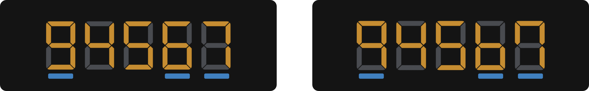
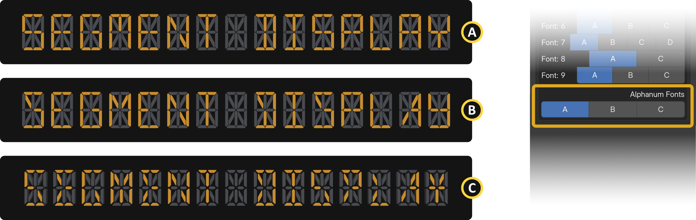

{ align=right width="350" }

The display is the core visual element of any segment display, the panel of illuminated segments that forms each digit or character. In real-world electronics, displays vary in segment count (7-segment for simple digits, 14 or 16-segment for full alphanumeric characters), thickness, angle, and overall styling. SegDisp Pro gives you full control over the display model, segment appearance, font variations, alignment, spacing, sizing, and material properties. This section covers all display-related inputs across four panels: Models & Styles, Segment Fonts, Align/Spacing/Size, and Appearances.

## Display | Models & Styles {: .clear }

{  width="1100" }

{ align=right width="350" }

**[1] Segment Display Models:** Selects the segment display model used for your digits and letters (e.g., 7-segment, 16-segment).

## Display | Fonts {: .clear }
### 7-Segment Fonts

{ align=right width="1100" }

{ align=right width="350" }

Switches to an alternative font variation. This option is limited to the digits 6, 9, and 7.

&nbsp;

### 16-Segment Fonts {: .clear }

{ width="1100" }

The 16-segment display unlocks a wide range of font possibilities, thanks to its higher segment count.

## Display | Align, Spacing, and Size {: .clear }

{ width="1100" }

{ align=right width="350" }

**[1] Display Horizontal & Vertical Align:** Aligns the display origin along both the horizontal and vertical axes.

## Display | Appearances {: .clear }

{ align=right width="350" }

**[1] Display Material:** Selects the material applied to the display.

- **Light-Emitting:** A glowing LED material where active segments emit light and inactive segments appear as a dark monochrome tone, creating the classic on-off contrast of real LED displays. Found on elevator floor indicators, electronic scoreboards, industrial control panels, gas station price signs, and digital alarm clocks.
- **Monochrome:**  A flat, non-emitting material where segments appear as solid dark shapes against a neutral background, with no glow or lighting effect. Mimics passive LCD panels found on calculators, digital watches, and air conditioning controllers, where segments are always visible but never illuminate.

### LED {: .clear }

{ align=right width="350" }

**[2] Toggle Led:** Enables or disables the LED emission effect on the display segments.

!!! info wrap
    This option is currently located in the Appearances panel, which has no direct relationship to it. A new feature called "Actions" is planned for the Segment Display Pro edition. All animation-related toggles will be moved to the new panel when it is implemented in the future.

**[3] Emission Color & Strength:** Sets the color and intensity of the LED emission on active (lit) segments.

!!! info wrap
    The strength option is not available for passive LED materials.

### LED Base