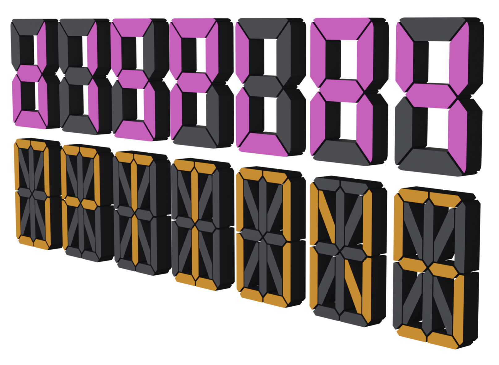{ align=right width="350" }

The display is the core visual element of any segment display, the panel of illuminated segments that forms each digit or character. In real-world electronics, displays vary in segment count (7-segment for simple digits, 14 or 16-segment for full alphanumeric characters), thickness, angle, and overall styling. SegDisp Pro gives you full control over the display model, segment appearance, font variations, alignment, spacing, sizing, and material properties. This section covers all display-related inputs across four panels: Models & Styles, Segment Fonts, Align/Spacing/Size, and Appearances.

## Display | Models & Styles {: .clear }

{  width="1100" }

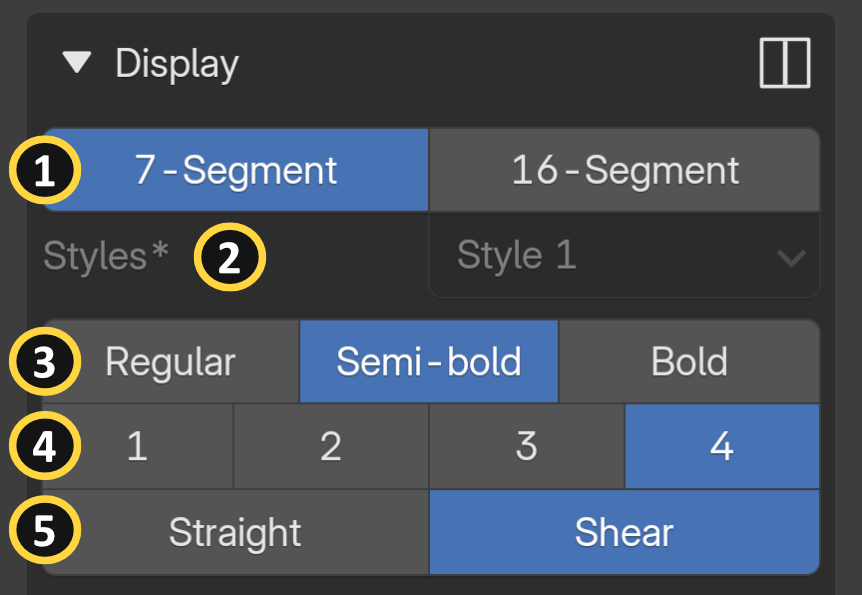{ align=right width="350" }

**[1] Segment Display Models:** Selects the segment display model used for your digits and letters (e.g., 7-segment, 16-segment).

**[2] Display Styles:** Selects a visual style preset for the segment display. 

!!! info wrap
    Only a single style is currently available. Additional styles are under development and will be included in future versions.

**[3] Segment Thickness:** Controls the thickness of individual segments in the display.

**[4] Segment Gap:** Adjusts the gap between individual segments within each character.

**[5] Display Angle:** Sets the display angle between straight and sheared (italicized) orientations.

---

## Display | Fonts {: .clear }
### 7-Segment Fonts

<figure markdown>
  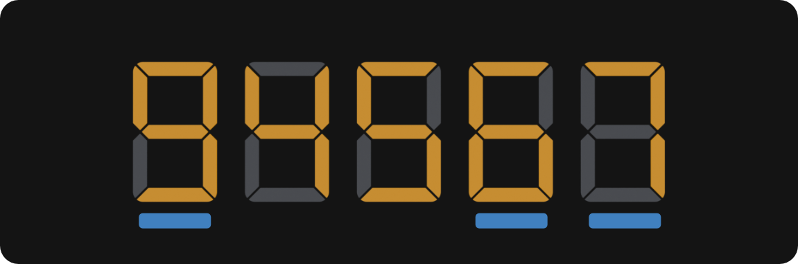{ width="400" }
  <figcaption>Font - A</figcaption>
</figure>

<figure markdown>
  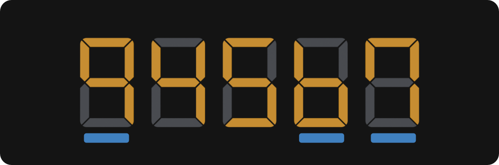{ width="400" }
  <figcaption>Font - B</figcaption>
</figure>

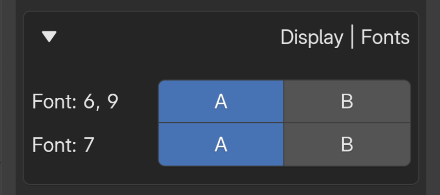{ align=right width="350" }

Switches to an alternative font variation. This option is limited to the digits 6, 9, and 7.

&nbsp;

---

### 16-Segment Fonts {: .clear }

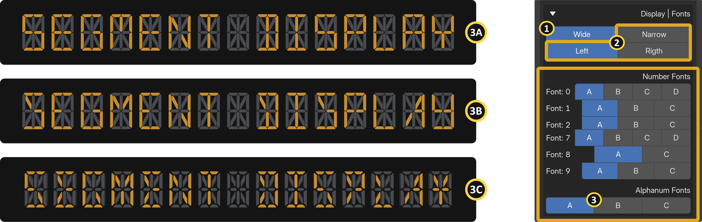{ width="1100" }

The 16-segment display unlocks a wide range of font possibilities, thanks to its higher segment count.

**[1] Font Width:** Adjusts the font to occupy either the full width or half of the display base. **Note:** Not available with the 7-Segment Display Model due to segment count limitations.

**[2] Font Align:** Aligns the font to the left or right side of the display base when "Narrow" is selected as the font width.

**[3] Font Alternatives:** Selects alternative font variations for numeric and alphabetic characters.

---

## Display | Align, Spacing, and Size {: .clear }

{ width="1100" }

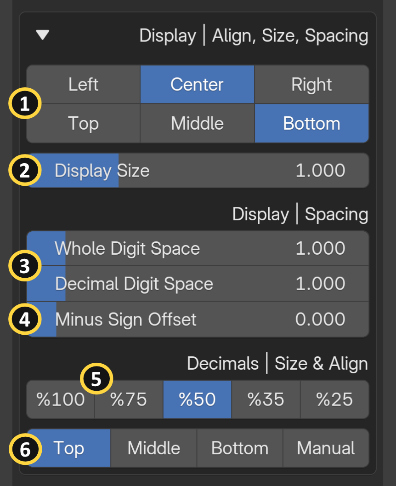{ align=right width="350" }

**[1] Display Horizontal & Vertical Align:** Aligns the display origin along both the horizontal and vertical axes.

**[2] Display Size:** Controls the overall scale of the display. 

!!! tip wrap
    Alignment and sizing options can be used to stack multiple display objects together.

**[3] Digit Spaces:** Controls the distance between digits of whole and decimal numbers in the `Numbers` and `Time` categories. 

!!! info wrap "To enable spacing  options, you need a display and a decimal length of at least two."

**[3] Character Space:** Controls the distance between character spaces in the `Alphanumeric` category. 

!!! info wrap "This option appears only if the Alphanumeric category is selected."

**[4] Minus Sign Offset:** Adjusts the minus sign offset relative to the display in the Numbers category.

**[5] Decimal Size:** Scales the decimal portion as a percentage relative to the main display size.

**[6] Decimal Vertical Position:** Sets the vertical position of the decimal portion relative to the display. **Vertical Manual Position:** Provides a custom manual vertical position value for the decimal portion.

---

## Display | Appearances {: .clear }

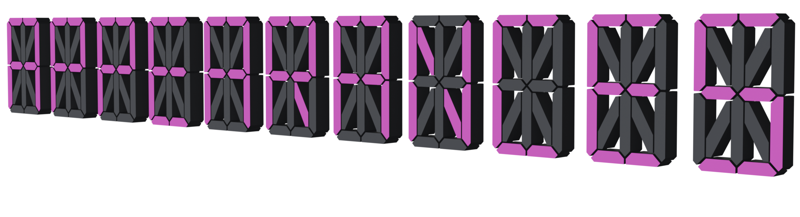{ align=right width="350" }

**[1] Display Material:** Selects the material applied to the display.

- **Light-Emitting:** A glowing LED material where active segments emit light and inactive segments appear as a dark monochrome tone, creating the classic on-off contrast of real LED displays. Found on elevator floor indicators, electronic scoreboards, industrial control panels, gas station price signs, and digital alarm clocks.
- **Monochrome:**  A flat, non-emitting material where segments appear as solid dark shapes against a neutral background, with no glow or lighting effect. Mimics passive LCD panels found on calculators, digital watches, and air conditioning controllers, where segments are always visible but never illuminate.

### LED {: .clear }

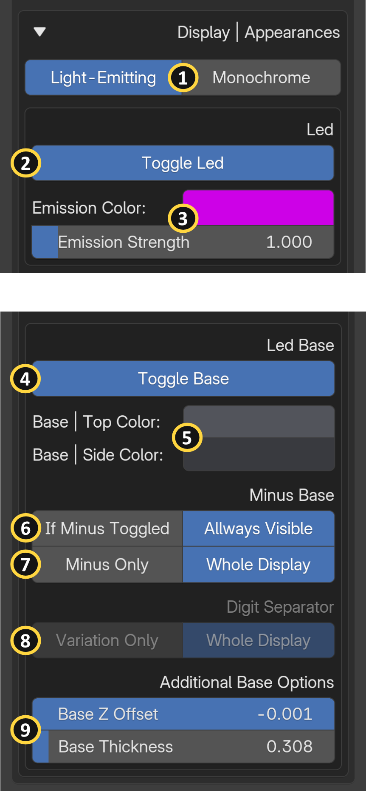{ align=right width="350" }

**[2] Toggle Led:** Enables or disables the LED emission effect on the display segments.

!!! info wrap
    This option is currently located in the Appearances panel, which has no direct relationship to it. A new feature called "Actions" is planned for the Segment Display Pro edition. All animation-related toggles will be moved to the new panel when it is implemented in the future.

**[3] Emission Color & Strength:** Sets the color and intensity of the LED emission on active (lit) segments.

!!! info wrap
    The strength option is not available for passive LED materials.

### LED Base

**[4] Toggle Led Base:** Enables or disables the display base panel behind the segments.

**[5] Base | Top/Side Colors:** Sets the color of the side/top surfaces of the base behind active segments. Each LED material has its own specific color settings.

**[6] Minus Sign Base Visibility:** Keeps the minus sign base permanently visible, even when the minus sign is disabled in the Numbers panel.

**[7] Minus Sign Base Style:** Selects whether to display the complete digit base or only the the minus sign's base.

<figure class="img-hover left" markdown>

  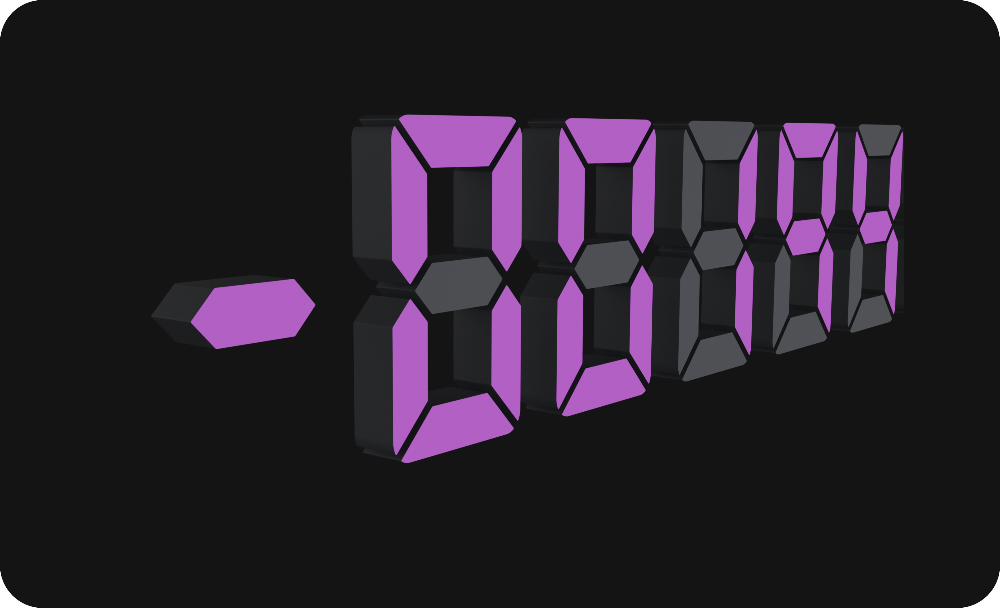{ width="400" }
  
  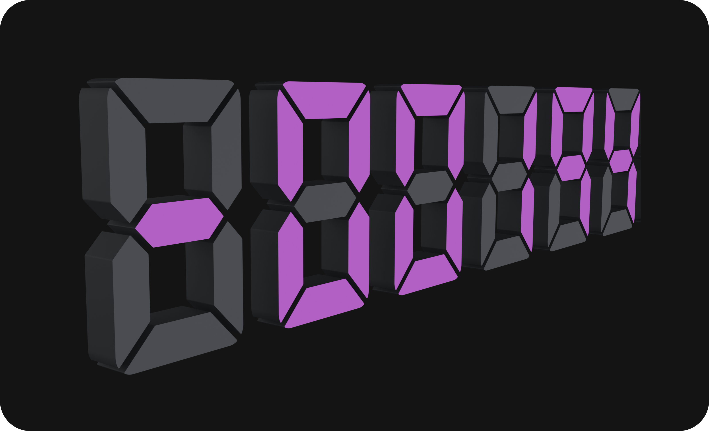{ .hover-img width="400" aria-hidden="true" }

</figure>

**[8] Digit Separator Base Style:** Selects whether to display the complete digit base or only the separator segment variations. For a more realistic look, select "Whole Display."

**[9] Base Z Offset & Thickness:** Controls the distance from the display base to the LED surface and the overall thickness of the base panel.
