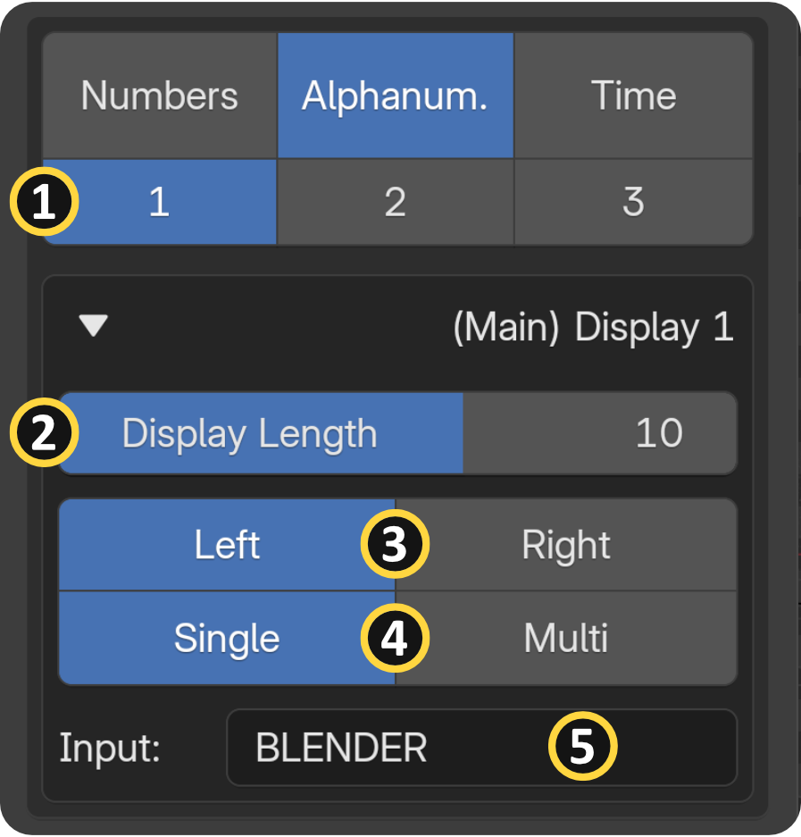
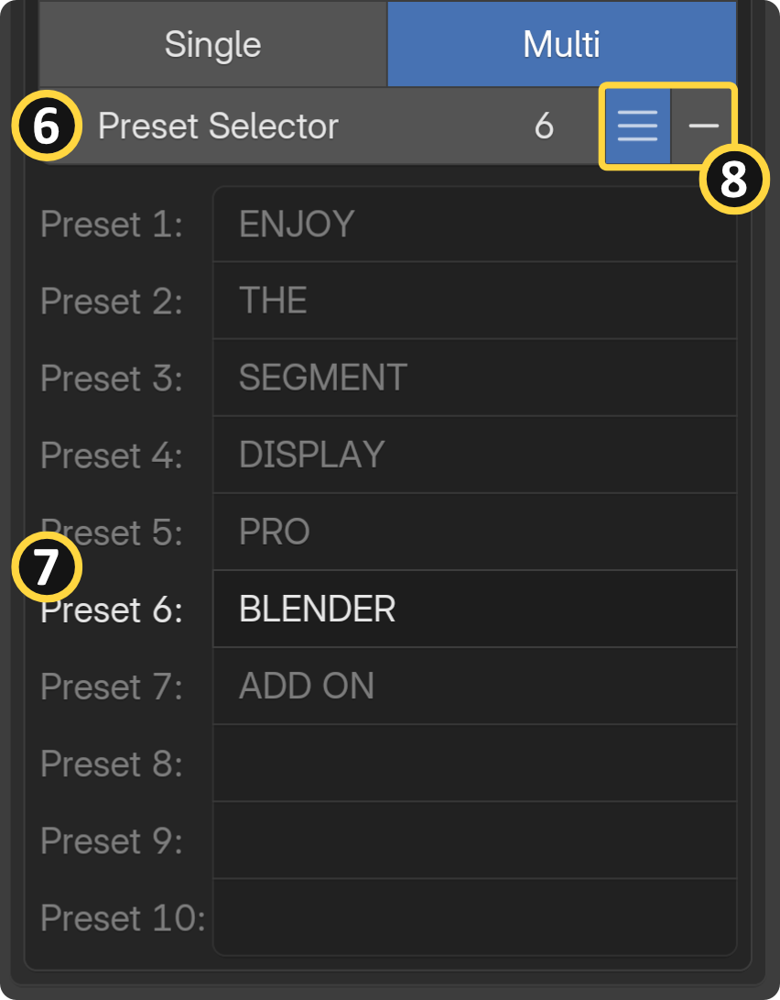
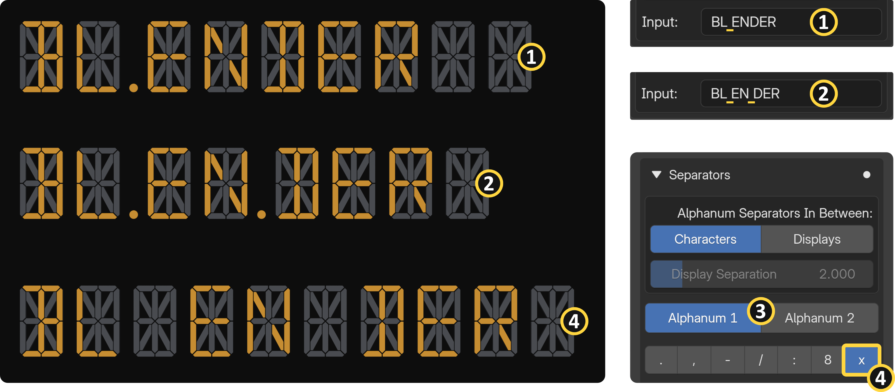
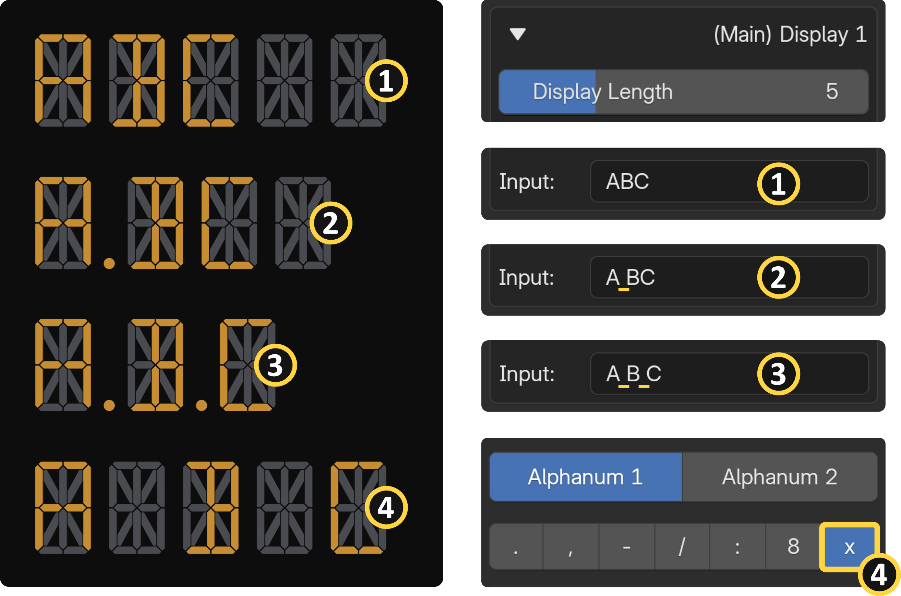
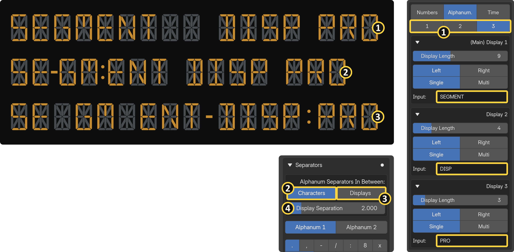

**Input Capabilities:** The Alphanumeric Main Display seamlessly processes inputs containing both numbers and letters, fully supporting both uppercase and lowercase characters, allowing you to mix and match digits and alphabetic characters freely within a single input. Both single and multi input options are available, and the input also supports blank spaces and separator characters.

{ align=right width="300" }

{ align=right width="300" }

## Inputs

**[1] Display Count:** The alphanumeric category allows you to utilize up to three separate displays simultaneously.

**[2] **Display Length:** The total number of digits shown in a single display.

**[3] **Alignment:** You can snap and align your text to either the left or right side of the digital display.

**[4] Input Options:** Single / Multi

**[5] Single Input:** Accepts a single text value containing both letters and numbers, including uppercase and lowercase characters, digits, blank spaces, and separator characters.

**[6] [7] Preset Selector & Slots:** Because Blender does not natively support the animation of string (text) inputs, the add-on includes a built-in multi-input preset system. By switching your input option to "Multi," you can type different words and numbers into a pre-defined list of up to 10 preset slots. You can then keyframe the "Preset Selector" number to animate the text changing over time. Please note that blank spaces and separator characters are not synced between presets. For a realistic result, you will need to configure them manually for each preset.

**[8] Preset Focus Mode:** To keep your add-on panel clean while working, you can focus on the currently selected preset and collapse the rest of the list. After defining your presets, click "Show Selected" for quick UI Management.

## Alphanumeric Separators (Using Spaces) {: .clear }

**[1] [2] Creating Separators:** To add a separator character between your data points, simply type a space directly between your inputs in the text field. Do not attempt to enter separator characters (like dots or dashes) directly into the input field, as this will cause an error.

**[3] Independent Separator Controls:** Each space you type automatically activates a dedicated tab ("Alphanum 1" and "Alphanum 2") in the Separators panel. By default, the first space generates a dot, and the second space generates a comma.

**[4] Simulating True Spaces:** If you want an actual blank space rather than a symbol, select "X" from the Separator panel's character menu. This will insert an extra, empty digit to simulate a blank space.

{ width="1200" }
!!! info "You can enter a maximum of two spaces per display."
     If you include more than two spaces, you will trigger an error or the display will appear empty.

!!! warning "Procedural Placement Warning"
     Because separators are generated procedurally from spaces rather than from direct text input, typing separator characters (such as dots or dashes) directly into the input field will not draw the separators. It will just add a blank space. The add-on exclusively accepts space characters as separator input. You can enter two space characters next to each other.

### Display Length Behavior

{ align=right width="600" }

When determining your overall "Display Length," remember that typing a space and selecting a separator character will take up exactly one digit of that total length. The same rule applies to the second separator character. To match the exact display length, use blank spaces.

### Multi-Display Setup {: .clear }

**[1] Adding Displays:** You can creatively arrange and utilize up to three separate alphanumeric displays (Main Display 1, Display 2, and Display 3) at the same time.

**Separators In Between Option:** 

- **[2] Characters**: Separator characters are inserted between each individual character of the text. (Main Display-1 only)
- **[3] Displays**: Separator characters are inserted between the additional displays.

**[4] Display Separations:** You can adjust the physical separation space between the main display and the additional displays using the "Display Separation" value.

{ width="1200" }

!!! warning "Important Separators Limitation"
     Please note that fully functional separator characters are exclusively available on Main Display-1. If you use spaces in Display 2 or Display 3, they will appear as empty digits rather than actual separator characters. For more complex setups, manually stack additional segment display objects next to each other.

See the [Separators page](separators.md#alphanumeric-specific-separator-options) for more information.