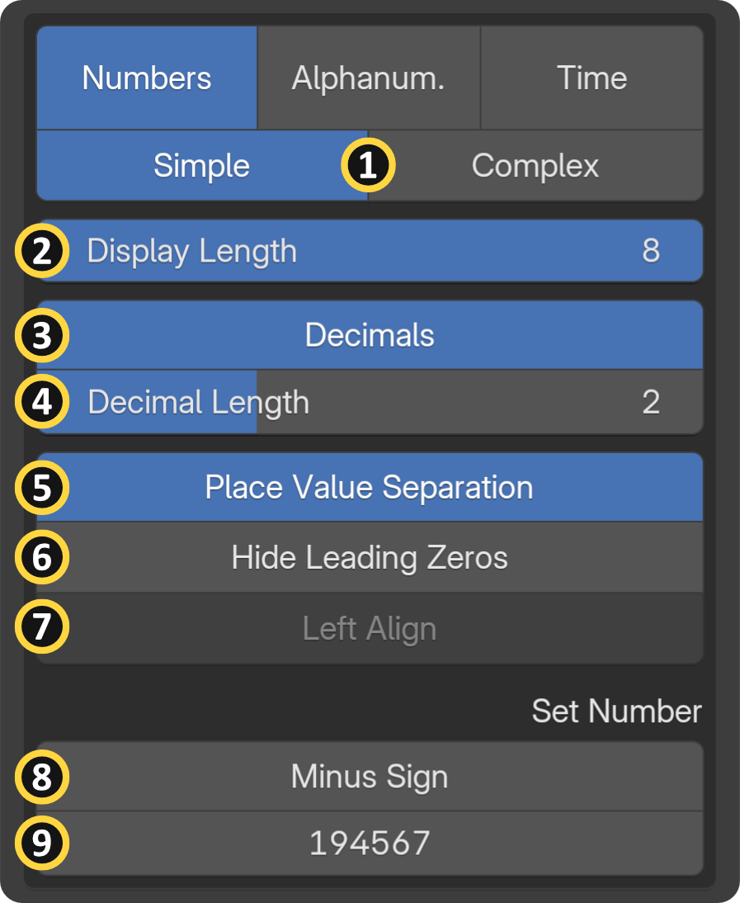
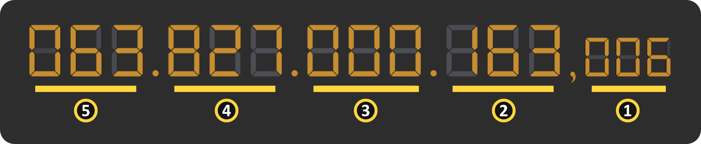
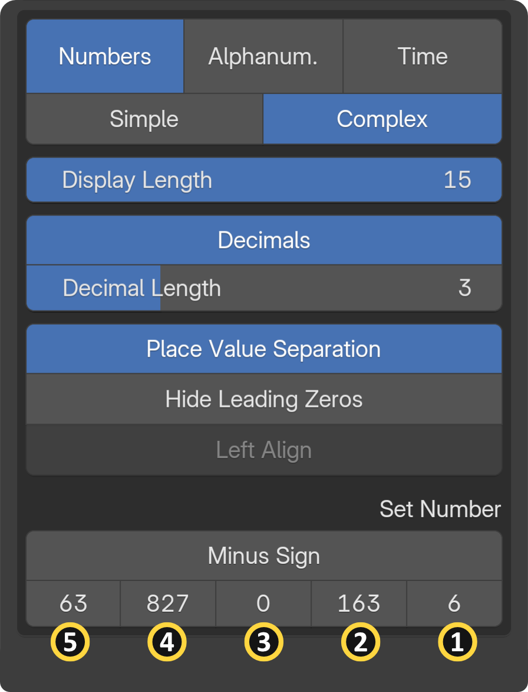

## Simple Number Inputs

{ align=right width="400" }

1. **Number Input Option:**
    - **Simple:** Up to 8 digits with a single input.
    - **Complex:** Up to 15 digits using five input groups.

2. **Display Length:** The Digit Count.

3. **Toggle Decimals** feature allows you to enable or disable decimal values within your digital readouts. Depending on the input category you are using, it serves a few specific purposes:

    - **In the Numbers Category:** Enabling this option allows you to set an exact "Decimal Count," giving you precise control over the decimal precision of your readout.

    - **In the Time Category (Timers):** Toggling timer decimals allows for high-precision time tracking. Once enabled, you can set the display to show specific decimal time units, such as centiseconds, deciseconds, or milliseconds.Read more on the [Time page](in_cat_time.md#timer).

4. **Decimal Length:** This option becomes available when the "Toggle Decimals" feature is enabled. It allows you to specify the number of decimal places to display in your digital readout, providing fine-tuned control over the precision of your numerical data.

    !!! info
        **Decimal Length** cannot equal the main **Display Length (1)**. An error message will appear if they match.

5. **Place value separation** is the system that determines how much each digit in a number is worth based on its position, which is calculated in powers of ten (ones, tens, hundreds, thousands, and so on).

6. **Hide Leading Zeros:** A leading zero is a "0" digit preceding the first non-zero digit in a number string. These zeros do not affect the mathematical value of whole numbers, so they can be omitted or hidden without losing information. However, leading zeros are necessary to convey magnitude for numbers after a decimal point and cannot be removed. The "Hide Leading Zeros" toggle in the Segment Display Add-on formats digital readouts by hiding non-value zeros next to numbers.

7. **Numbers Left Align:** The current number is snapped to the left side of the display. This feature is only available if "decimals" or "place value separation" is disabled.

8. **Minus Sign:** Procedurally toggles the minus sign to produce negative numbers.

9. The current number for the **Simple Input** Option.

## Complex Number Input

Overcoming Software Limits with "Complex Input": Blender uses single-precision floats (float32), which means that if you try to type a standard number longer than 7 digits, it will become inaccurate and produce calculation errors. To bypass this and safely reach the hundred trillion, the add-on uses Complex Input Options. Instead of typing a massive 15-digit string all at once, you input values into manageable three-digit blocks (ranging from 0-999) categorized by their place value.

<figure markdown>
  { width="600" }
</figure>

<figure markdown>
  { width="400" }
</figure>

