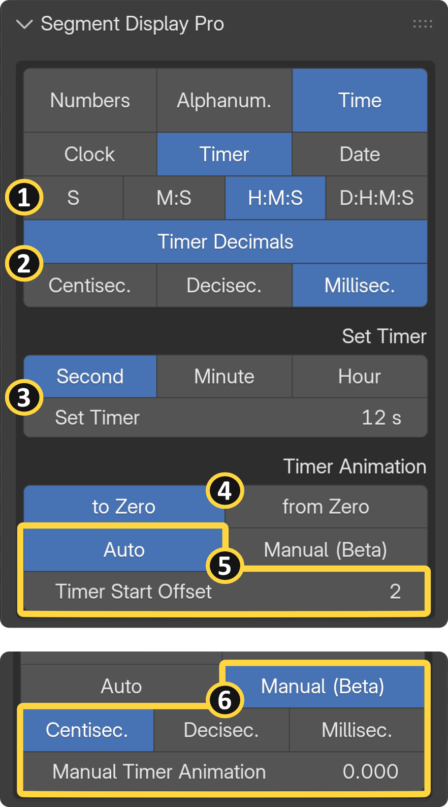
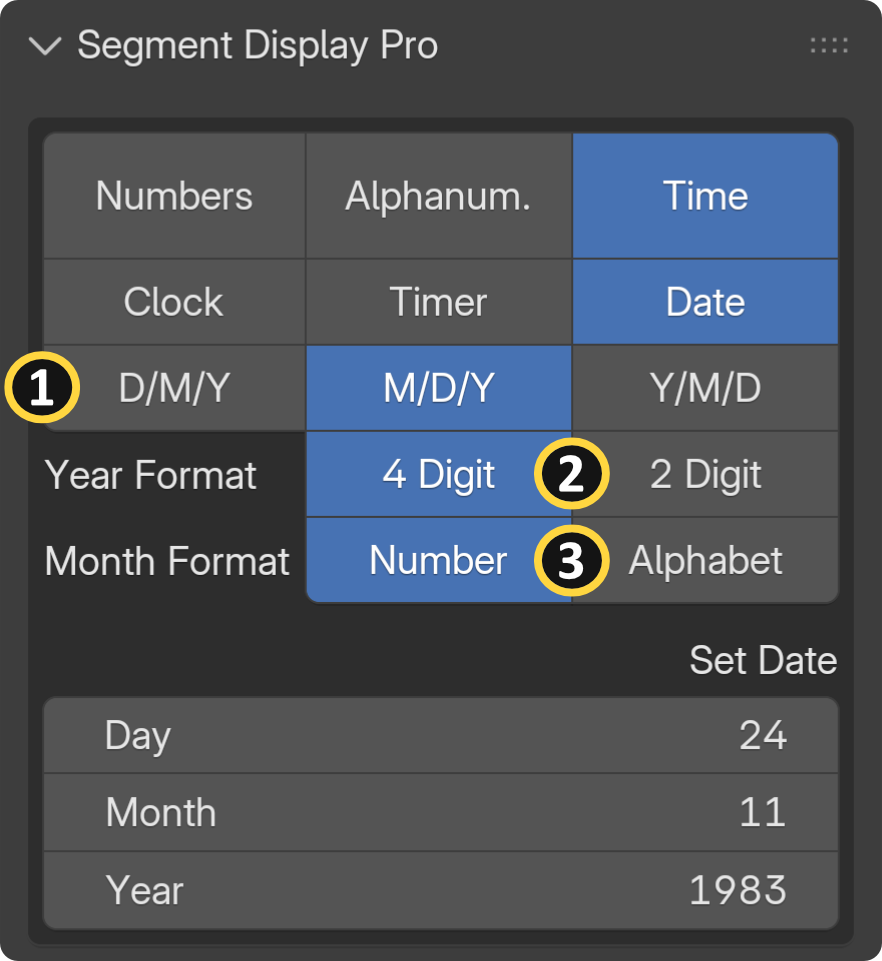
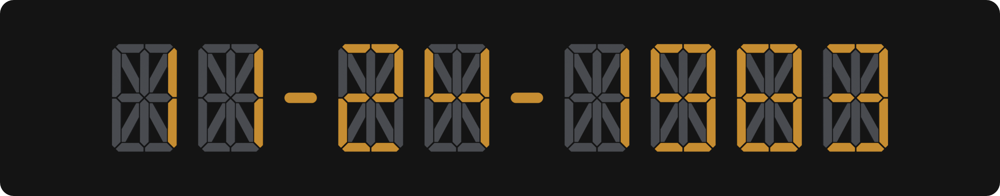
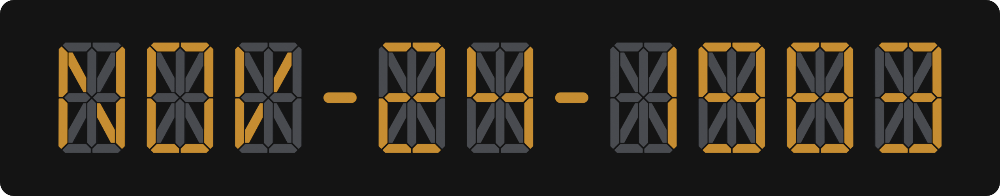

{ align=right width="350" }

## General Overview 

The Time module allows you to animate digital clocks, countdown timers, and calendar dates without the hassle of complex math or node trees.

Animation Modes: You can fully automate your displays by syncing them directly to your Scene Time, or switch to Manual Keyframing to create stylized, non-linear time animations.

## Clock {: .clear }

{ align=right width="350" }

Build realistic digital clocks effortlessly. You can manually input the exact Hour, Minute, and Second, and precisely control the readout by toggling seconds on or off.

**[1] Time Categories:** Clock, timer and date

**[2] Time Format:** Choose between standard 12h or 24h clock formats.

**[3] Toggle Seconds:** Show/Hide second units.

**[4] Initial Time:** In this example, an initial time of 19:00 is entered. Since 12-hour format is selected, the display shows 07:00.

**[5] Time Direction:** You can reverse the flow of time by switching the animation direction between Clockwise and Counterclockwise.

**[6] Auto Time Animation:** The clock starts when you hit play in the scene. **Start Offset** lets you specify the exact frame number at which the animation begins playing back.

**[7] Manual Time Animation:** You can manually keyframe your animation in non-linear time. The multiplier menu also lets you create high-speed time lapses by scaling your input range — for example, multiplying the speed so that one input second visually represents a full minute or even an hour:

!!! info "Time Example"
     |If the clock is set to **07:00:00** and the animation slider to **1s**:||
     | --- | --- |
     | 1 second = [a second]: | 07:00:01|
     | 1 second = [a minute]: | 07:01:00|
     | 1 second = [an hour]: | 08:00:00|

!!! failure "Wrong Results"
     When setting the time, if you see incorrect results on the display, make sure your scene's animation playhead is set to frame 0 or 1.

!!! warning "Frame Rate Syncing (Important)"
     Auto time animations only perform properly in sync with whole number frame rates (such as 24, 25, 30, or 60 fps). Fractional frame rates like 29.97 fps will not provide accurate results. Always ensure the add-on frame rate in the "Addon Settings" panel matches your scene frame rate. See the [Settings Page](prefs_and_settings.md#time-synchronization) for more details.

## Timer {: .clear }

{ align=right width="350" }

Perfect for explosive countdowns or intricate chronometers, the Timer feature spans across days, hours, minutes, and seconds.

**[1] Whole Timer Units:** `S`: Seconds, `M`: Minutes, `H`: Hours, `D`: Days.

**[2] Decimal Timer Units:** For high-precision readouts, enable decimal times to display centiseconds, deciseconds, or milliseconds.

**[3] Set Timer & Multiplier:** Easily set massive durations without doing complex math or trying to enter huge values directly into the "Set Timer" input field. For example, setting the multiplier menu to **"`Hour`"** and the input to `24s` will automatically calculate the 86,400 seconds needed for a **1-Day** countdown.

**[4] Timer Direction: :** Set your timer to count `To Zero` (e.g., 3 - 2 - 1 - 0) or `From Zero` (e.g., 0 - 1 - 2 - 3). If you set your timer to `7` for example, counting *To Zero* means the timer will count down from `7` and stop at `0`, while counting *From Zero* means the timer will start at `0` and stop once it reaches `7`.

**[5] Auto Timer Animation:** The timer starts when you hit play in the scene. **"Start Offset"** lets you specify the exact frame number at which the animation begins playing back.

**[6] Manual Timer Animation & Decimal Precision (Beta):** When manually keyframing timer animations, you have full control over decimal precision by choosing between Centiseconds, Deciseconds, or Milliseconds — available when **"Timer Decimals"** is enabled.

- High Precision (Milliseconds): Choose this option for ultra-precise, detailed readouts. Because of the high data density, slider adjustments will feel slower and more sensitive.

- Standard Precision (Centiseconds - Default): The recommended setting for most workflows. It provides faster slider responsiveness and is the optimal choice if you are primarily animating whole-time units (like seconds, minutes, or hours).

!!! info "True Zero Offset"
     If you want your timer to start from a true zero time, adjust the **Timer Start Offset:** set it to `2` if your timeline playhead starts at keyframe 1, or set it to `1` if your playhead starts at keyframe 0.

## Date {: .clear }

{ align=right width="350" }

Quickly generate procedural calendar readouts with full formatting control over your display.

**[1] Date Format:** Customize the exact order of your calendar units (Day, Month, Year) to fit your regional layout.

**[2] Year Format:** Choose to display the year as either a minimal 2-digit or a full 4-digit readout.

**[3] Month Format:** You can represent the month as a standard numeric value or switch to a 3-digit alphabetic value for a more advanced UI aesthetic. Note: The alphabetic month format is exclusively available when using the 16-Segment Display Model, due to the segment count limitations of the 7-Segment model.

<figure markdown>
  { width="400" }
  <figcaption>Numeric</figcaption>
</figure>

<figure markdown>
  { width="400" }
  <figcaption>Alphabet</figcaption>
</figure>

