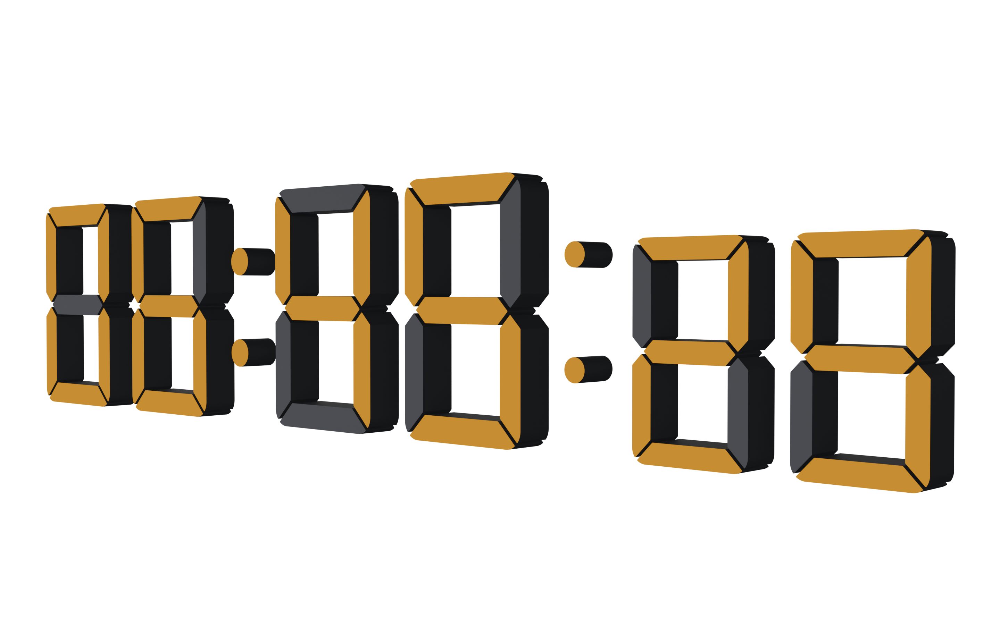

{ align=right width="350" }

## General Overview 

The Time module allows you to animate digital clocks, countdown timers, and calendar dates without the hassle of complex math or node trees.
Animation Modes: You can fully automate your displays by syncing them directly to your Scene Time, or switch to Manual Keyframing to create stylized, non-linear time animations.

!!! info "Frame Rate Syncing (Important)"
     Auto time animations only perform properly in sync with whole number frame rates (such as 24, 25, 30, or 60 fps). Fractional frame rates like 29.97 fps will not provide accurate results. Always ensure the add-on frame rate in the "Addon Settings" panel matches your scene frame rate. See the [Settings Page](prefs_and_settings.md#time-synchronization) for more details.

## Clock {: .clear }

## Timer

## Date