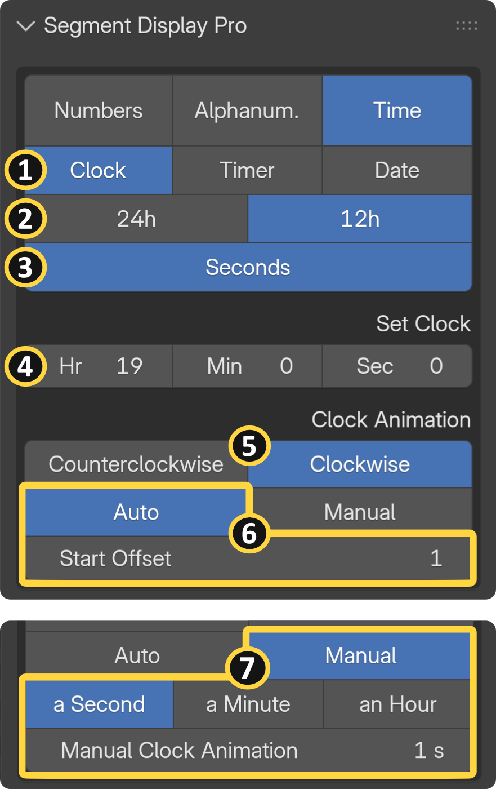

{ align=right width="350" }

## General Overview 

The Time module allows you to animate digital clocks, countdown timers, and calendar dates without the hassle of complex math or node trees.
Animation Modes: You can fully automate your displays by syncing them directly to your Scene Time, or switch to Manual Keyframing to create stylized, non-linear time animations.

## Clock {: .clear }

{ align=right width="350" }

Build realistic digital clocks effortlessly. You can manually input the exact Hour, Minute, and Second, and precisely control the readout by toggling seconds on or off.

**[1] Time Categories:** Clock, timer and date

**[2] Time Format:** Choose between standard 12h or 24h clock formats.

**[3] Toggle Seconds:** Show/Hide second units.

**[4] Initial Time:** In this example, an initial time of 19:00 is entered. Since 12-hour format is selected, the display shows 07:00.

**[5] Time Direction:** You can reverse the flow of time by switching the animation direction between Clockwise and Counterclockwise.

**[6] Auto Time Animation:** The clock starts when you hit play in the scene. **Start Offset** lets you specify the exact frame number at which the animation begins playing back.

**[7] Manual Time Animation:** You can manually keyframe your animation in non-linear time. The multiplier menu also lets you create high-speed time lapses by scaling your input range — for example, multiplying the speed so that one input second visually represents a full minute or even an hour:

!!! info "Time Example"
     |If the clock is set to **07:00:00** and the animation slider to **1s**:||
     | --- | --- |
     | 1 second = [a second]: | 07:00:01|
     | 1 second = [a minute]: | 07:01:00|
     | 1 second = [an hour]: | 08:00:00|

!!! warning "Frame Rate Syncing (Important)"
     Auto time animations only perform properly in sync with whole number frame rates (such as 24, 25, 30, or 60 fps). Fractional frame rates like 29.97 fps will not provide accurate results. Always ensure the add-on frame rate in the "Addon Settings" panel matches your scene frame rate. See the [Settings Page](prefs_and_settings.md#time-synchronization) for more details.

## Timer {: .clear }

## Date {: .clear }