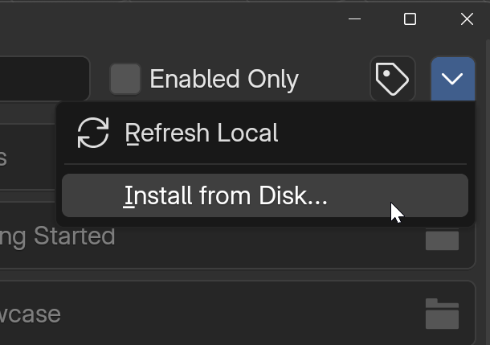
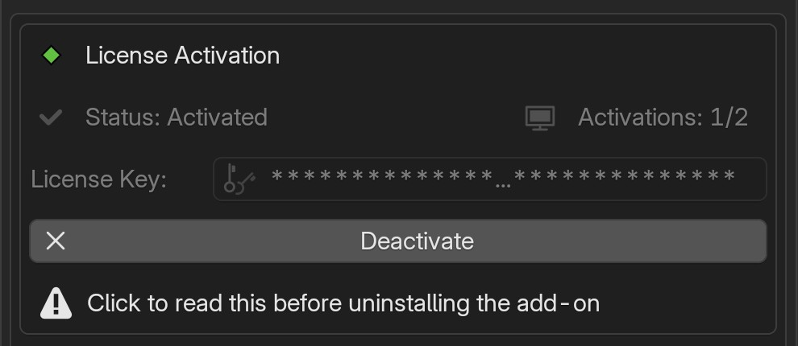

# Installation & Activation

!!! info
    Both editions of Segment Display are distributed as zip-formatted Blender legacy add-ons, not extensions. Install them from the "Add-ons" tab in the Preferences window using the "Install from Disk" option in the top-right dropdown menu.

## Requirements

Before you begin, make sure your system matches the add-on's requirements:

| Item                | Requirement         |
| ------------------- | ------------------- |
| Compatible Blender  | 5.1.1                  |
| Render Engines      | Eevee, Cycles          |
| OS Platforms        | Windows, Linux, macOS  |
| Add-on Format       | Legacy/zip             |
| Script Size         | 492 – 575 KB           |
| Asset Size          | 170 – 200 MB           |

!!! info "OS Compatibility"
    The Segment Display add-on was not developed for a specific operating system. However, it has only been tested on a Windows 11 system. Before purchasing the Pro edition, we recommend testing your system with the free Lite edition.

## Downloading the Add-on

Download the Segment Display Pro zip file from your purchase/download location.
You will also receive a license key, which is required to unlock the product.

## Installation

The add-on ships with the asset blend file already included in the zip package. It will be installed automatically into the Blender addons directory when you complete the installation steps below.

!!! warning "Do not unpack the "segment_display_pro_vX.X.X.zip" file"
    Install the add-on directly from the zip file. Do not extract or rename the
    files inside it, as this can break the add-on.

{ align=right width="350" }

1. Open Blender and go to **Edit** → **Preferences**.
2. Switch to the **Add-ons** tab.
3. Click the **Install** button (the arrow icon in the top-right of the window).
4. Browse to and select the **Segment Display Pro zip file**, then click
   **Install Add-on**.
5. Find **Segment Display Pro** in the list and enable it by ticking its
   checkbox.

After enabling, the add-on appears in the 3D Viewport sidebar under the
**SegDisp Pro** tab.

## Add-on Default File Directory

The add-on and its related asset files will be installed in the same directory (Blender Foundation scripts\addons).

- WINDOWS:
      - Add-on Script Files: `C:\Users\$USER\AppData\Roaming\Blender Foundation\Blender\5.1\scripts\addons`
      - Add-on Asset Files: `C:\Users\$USER\AppData\Roaming\Blender Foundation\Blender\5.1\scripts\addons\segment-display-pro\assets`
- MacOS: `/Users/$USER/Library/Application Support/Blender/5.1/scripts/addons/`
- Linux: `~/.config/blender/5.1/scripts/addons/`

!!! warning "Custom Add-on Directory"
    If you use a custom add-on directory, proper linking of asset files within a scene cannot be guaranteed, even when the add-on uses relative paths to reference assets. This add-on has only been tested with the default Blender scripts directory.

## Activation/Deactivation

{ align=right width="500" }

After purchasing Segment Display Pro, you will receive an order confirmation email from Lemon Squeezy containing your license key. You can also find your license key anytime in your customer billing portal under your subscription details.

To activate, copy your license key and paste it into the License Key field in the add-on preferences panel, then click Activate. **(Mouse Right-click to paste does not work — use Ctrl+V instead.)** The status monitor above the key field displays your current activation status (top-left) and your activation limit/seats (top-right).

!!! internet "Internet Connection Required"
    License activation and deactivation both require an internet connection. Activation validates your license key online, and deactivation contacts the server to free up your activation slot. This ensures your activation count stays accurate and protected. If either fails, make sure "Allow Online Access" is enabled in Blender under Preferences > Network tab.

Upon successful activation, the add-on creates a file called **sdp_activation.dat** in the add-on's root directory. This file stores your activation data in encrypted form and ensures your license persists correctly between Blender sessions.

!!! warning "Do not delete the .dat file!"
    Do not delete, rename, or move this file. It is automatically removed when you deactivate your license. If this file is missing or tampered with, your activation may break and require reactivation.

!!! privacy "Privacy Notice"
    During license activation, your custom device name (e.g., QUEEN-WINDOWS11) is stored on our online system dashboard. This information is used exclusively by our customer support team to assist you in the event of any activation issues. By activating your license, you consent to sharing this device identifier with us.

## Uninstalling

!!! warning "Always deactivate your license before uninstalling the add-on"
    If you remove the add-on without deactivating first, the device will still count toward your activation limit. Unfortunately, Blender does not allow add-ons to prevent or intercept the uninstall action. If you accidentally uninstall without deactivating, you can manage your activation seats yourself by logging into the <a href="https://app.lemonsqueezy.com/my-orders" target="_blank" rel="noopener">Lemon Squeezy customer portal</a> with your purchase email. Under your order's license key details, you can view all active devices and deactivate any instance to free up a seat. If you need help with this, please reach out to our support email for guidance.

!!! info "Your objects stay safe"
    Uninstalling the add-on does not delete existing segment display objects and the asset file. The linked asset data is embedded in your project library, and object settings are
    preserved in the Geometry Nodes modifiers. If you re-install the add-on, you can continue to work where you left.
