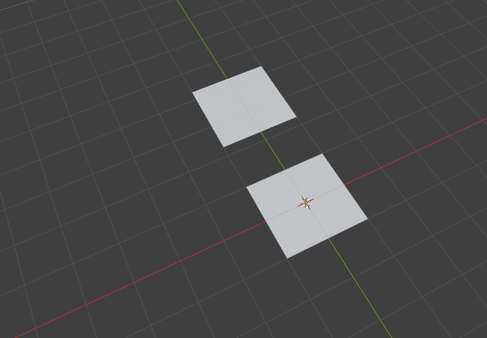
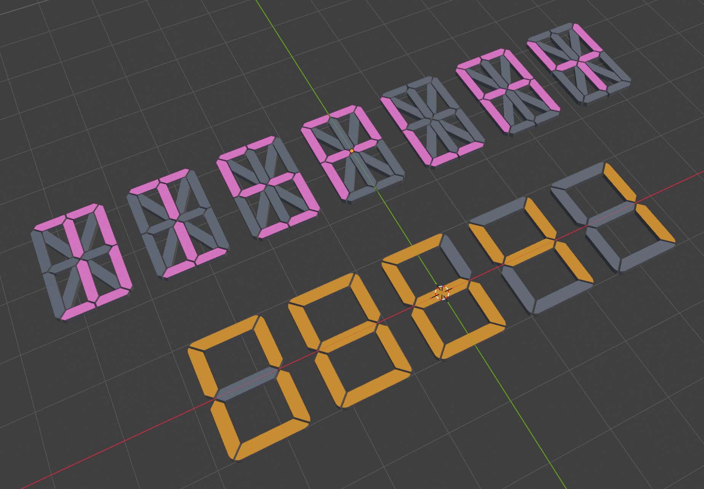
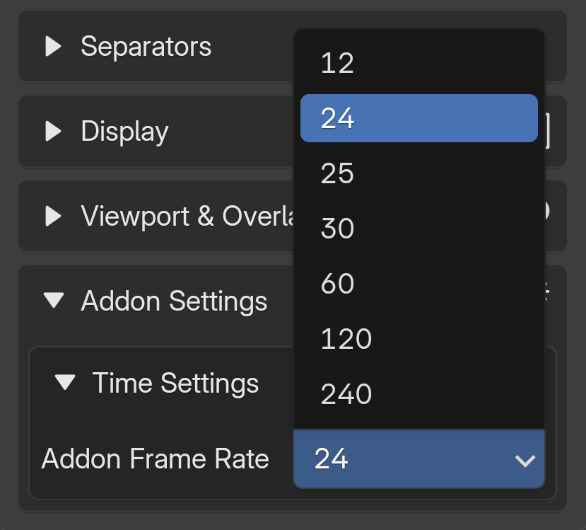
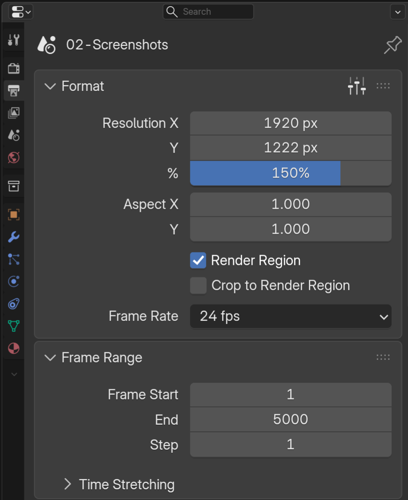

The Settings & Preferences panel is where you manage your license activation and monitor the health of your linked asset files. Access it via Edit > Preferences > Add-ons, then expand the Segment Display Pro entry.

## License Activation

{ align=right width="550" }

The License Activation section displays your current activation status and allows you to manage your license key.
Status: Shows whether your license is currently activated or not (checkmark icon when active).
Activations: Displays how many device slots you've used out of your total allowance (e.g. 1/2).
License Key: The masked key field where you enter or view your license key.
Deactivate: Removes the license activation from the current device, freeing up a slot for use on another machine.

!!! warning
     Always deactivate your license before uninstalling the add-on. If you skip this step, the device will still count toward your activation limit. See the [Activation page](installation.md#activationdeactivation) for more details.

## Asset Status Panel

{ align=right width="550" }

The Asset Status section monitors the connection between the add-on and its asset .blend file. On each Blender launch, the add-on checks whether the asset file is available in the segment_display/assets directory.

The asset is not linked automatically on Blender launch; instead, it links when the user adds objects to the 3D scene or clicks the "Re-link Asset" button. This mechanism safeguards your scene: if the add-on is uninstalled or the asset file is accidentally deleted, reinstalling the add-on and clicking "Re-link Asset" will restore all Segment Display objects in the scene.

### How It Works

The SegDisp asset is stored as a .blend file in the add-on's assets folder. When properly linked, clicking "Add Segment Display" instantly places the full Geometry Nodes-driven segment display objects into your scene. If the asset becomes unlinked (e.g. the file is missing or the add-on was removed), those objects revert to default 2×2m placeholder planes until the link is restored.

<figure markdown>
  { width="400" }
  <figcaption>Un-linked Asset</figcaption>
</figure>

<figure markdown>
  { width="400" }
  <figcaption>Linked Asset</figcaption>
</figure>

The **Re-link Asset** button performs a manual asset check. It verifies that the asset .blend file exists in the add-on's asset folder and, if found, replaces any placeholder planes in the current scene with the proper Segment Display objects. Use this if your displays appear as flat planes after a reinstall or file path change.

### Asset Monitor

Below the Re-link button, grayed-out text displays the current asset status:

- **Link status:** Shows "Linked" (with a checkmark) when the asset file is properly installed and in place, or flags an issue if it is missing.
- **Asset file:** Displays the name and version of the linked blend file and the Geometry Nodes tree version.

### Linked Asset

{ align=right width="500" }

You can also verify the linked asset file from Blender's Outliner area using the Blender File display mode. Filtering by the Node Tree data type makes it easier to identify.

!!! warning "Do not manually remove the asset file from the Outliner"
     As doing so will cause you to lose your current Segment Display object settings and Geometry Nodes Modifier configuration.

## Addon N-panel Settings
### Time Synchronization

Time Synchronization syncs the Clock and Timer display values to Blender's timeline, matching the add-on's FPS with the scene FPS so the displayed time updates accurately as the animation plays.
Set the FPS using the Addon Frame Rate dropdown menu in Addon Settings to match your project's frame rate.

The Animation Start Offset option, available in both Clock and Timer, calculates its timing based on the scene FPS and the add-on's internal FPS. 

!!! info
     This option only works correctly with whole-number frame rates (e.g., 24, 25, 30, 60). Decimal frame rates such as 23.98 or 29.97 will produce slightly inaccurate results due to mathematical limitations.

<figure markdown>
  { width="400" }
  <figcaption>Addon FPS</figcaption>
</figure>

<figure markdown>
  { width="400" }
  <figcaption>Scene FPS</figcaption>
</figure>

