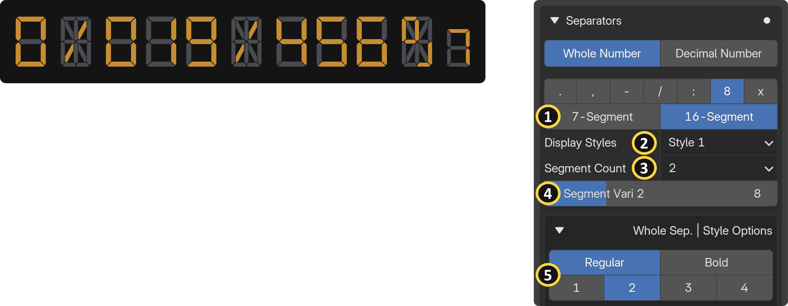
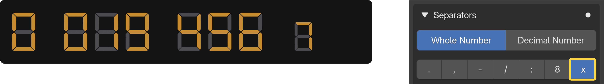

{ align=right width="350" }

Separators are the characters placed between digits or display groups, such as colons, dots, dashes, and other shapes. In real-world electronics, these are commonly seen as the blinking colon on a digital clock or the decimal point on a calculator. SegDisp Pro gives you full control over which separator characters to use, their shape and style, and precisely where they sit relative to your digits. This section covers all separator-related inputs across five panels: Alphanumeric settings, Characters & Shapes, Styles, Position/Spacing/Size, and Decimal-specific options.

## General Separator Options

{ align=right width="350" }

## Alphanumeric Specific Separator Options {: .clear }

{ align=right width="350" }

## Digit-Specific Separator Character {: .clear }

{ width="1100" }

## Non-character Option {: .clear }
 
{ width="1100" }

