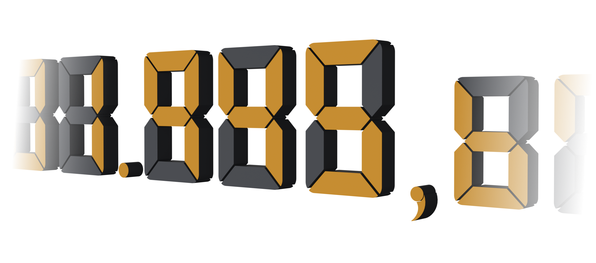
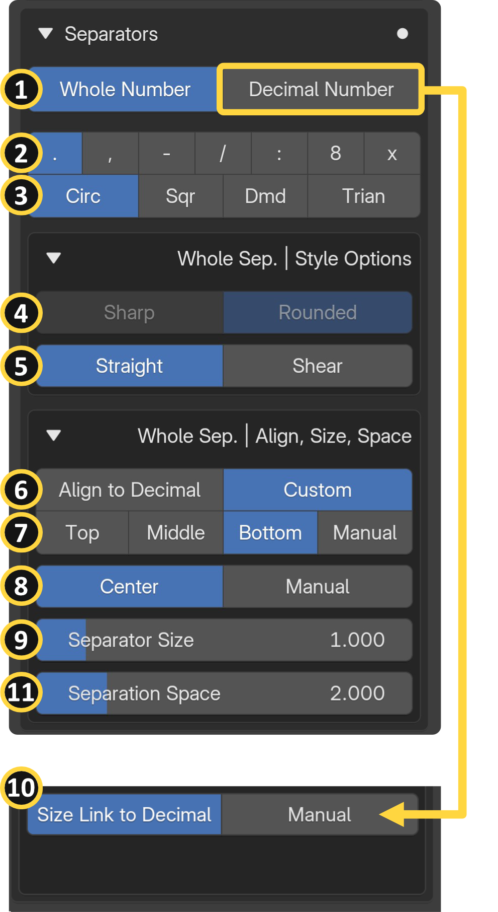
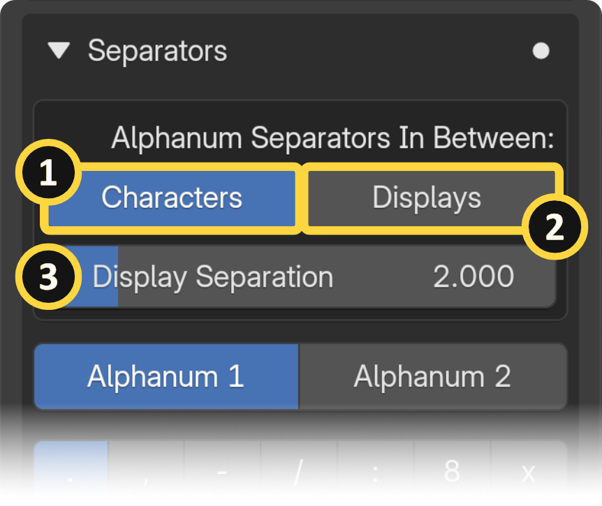
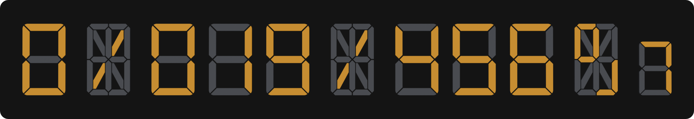
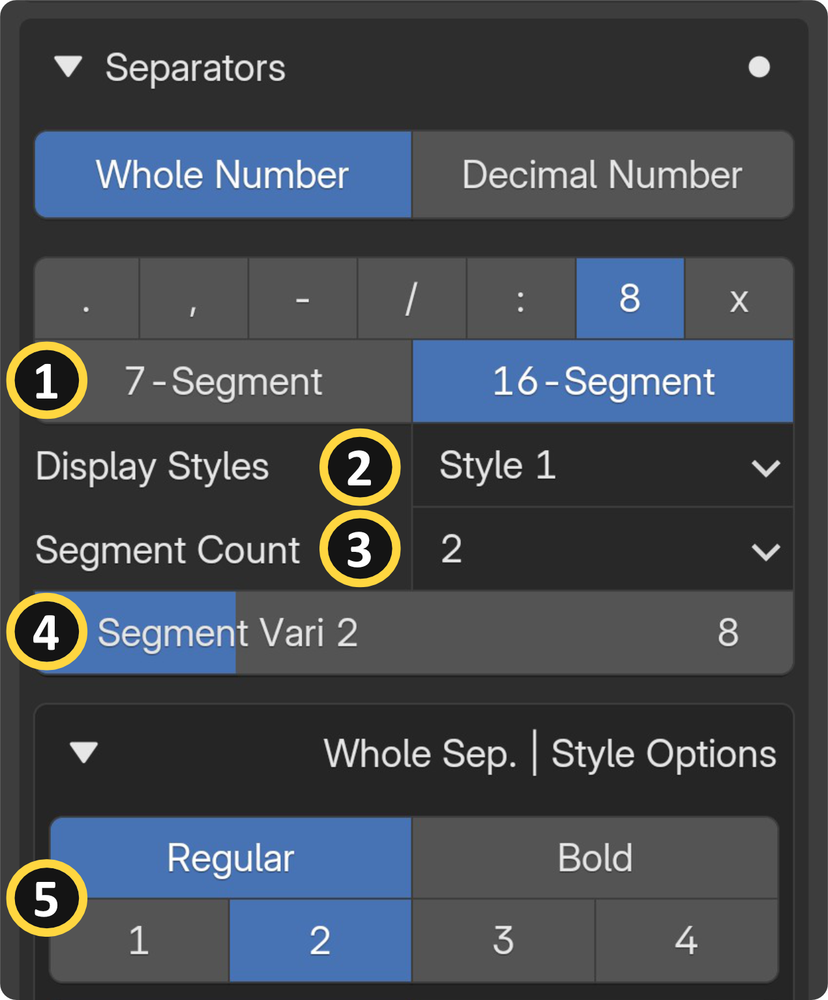
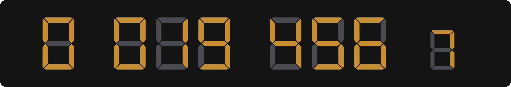
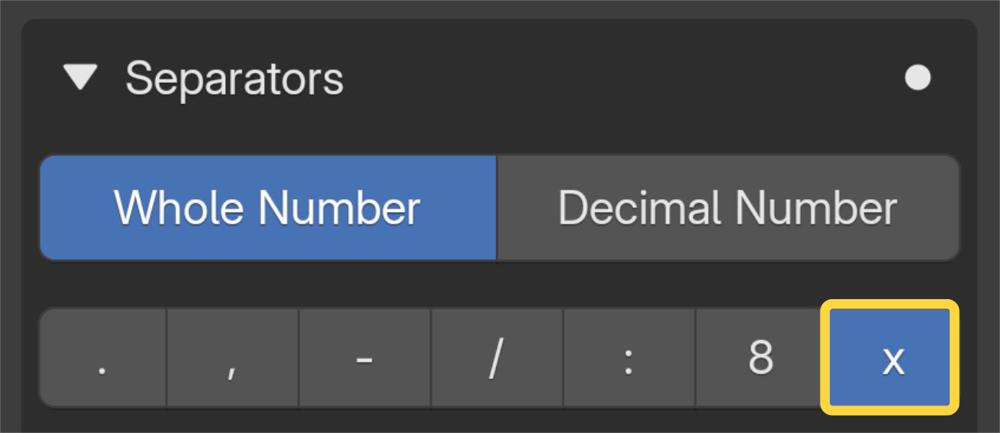

{ align=right width="350" }

Separators are the characters placed between digits or display groups, such as colons, dots, dashes, and other shapes. In real-world electronics, these are commonly seen as the blinking colon on a digital clock or the decimal point on a calculator. SegDisp Pro gives you full control over which separator characters to use, their shape and style, and precisely where they sit relative to your digits. This section covers all separator-related inputs across five panels: Alphanumeric settings, Characters & Shapes, Styles, Position/Spacing/Size, and Decimal-specific options.

## General Separator Options

{ align=right width="350" }

**[1] Separators tab:** Select which separator to edit. Use this tab to switch between the different separators available in your display, allowing you to configure each one individually.

**[2] Characters:** Selects which character is used as the separator between digits (e.g., colon, dot, dash, slash).

**[3] Shape:** Selects the geometric shape used as a separator character (e.g., circle, diamond, triangle, square).

Each character and shape has its own dedicated settings and properties. These options appear on the UI depending on your selection:

- **Diamond Variation:** Cycles through diamond shape variations when diamond is selected as the separator shape.
- Triangle Direction: Sets the pointing direction of the triangle separator character.
- **Triangle Tip Align:** Adjusts the alignment of the triangle's tip relative to the display.
- **Slash / Line:** Switches between a slash, backslash, or straight line as the separator character.
- **Dash Thickness:** Controls the thickness of the dash separator character.
- **Dash Length:** Controls the length of the dash separator character.
- **Colon Distance:** Adjusts the vertical spacing between the two dots of the colon separator.

**[4] Shape Corners:** Toggles between sharp or rounded corners on the separator character shapes. **Round Style:** Selects the rounding style applied to dash or slash/line rectangle-shaped characters.

**[5] Character Angle:** Tilts the separator character to a custom angle. Note: Not available for slash and line characters.

**[6] Vertical Position:** Sets the separator's vertical alignment. The character can be automatically aligned to the decimal digit position or manually adjusted to your preference. Decimal digit position options can be found on the [Display page](display.md).

**[7] Custom Vertical Position:** Provides a custom vertical position value when automatic alignment is not selected. **Manual Vertical Offset:** Manually adjusts the vertical offset of the separator character.

**[8] Horizontal Position:** Sets the separator's horizontal alignment. Can be centered automatically within the digit spaces or offset based on your preferred value. **Manual Horizontal Offset:** Applies a manual horizontal offset to fine-tune the separator's left/right placement.

**[9] Separator Size:** Scales the overall size of the separator character. There is an additional specific size option for the decimal-side separators **[10]** that allows you to link the separator size to the decimal digit size. Decimal digit size options can be found on the Display page. **Note:** Not available for dash, slash, and line characters since they have their own dedicated size settings.

**[11] Separation Spaces:** Controls the spacing around separators. The same option is labeled "First/Second Separation Spaces" for the Alphanumeric input category. 

## Alphanumeric Specific Separator Options {: .clear }

{ align=right width="350" }

Separators In Between Option:

**[1] Characters:** Separator characters are inserted between each individual character of the text. (Main Display-1 only)

**[2] Displays:** Separator characters are inserted between the additional displays.

**[3] Display Separations:** You can adjust the physical separation space between the main display and the additional displays using the "Display Separation" value. 

See the [Alphanumeric Input page](in_cat_alphanum.md#multi-display-setup) for more information.

## Digit-Specific Separator Character {: .clear }

{ width="1100" }

{ align=right width="350" }

**[1] Display Models:** Selects the segment display model used for the separator's digit characters.

**[2] Display Styles:** Selects a visual style preset for the digit separator characters.*

!!! info wrap "* Info"
    There is only a single style currently available. The remaining styles are still under development and will be included in future versions.

**[3] Digit Segment Count:** Sets the number of segments used for the segment variation presets.

**[4] Segment Variations:** Sets the number of segments used for the segment variation presets.

**[5] Additional Style Options for the Digit Character:** Sets the number of segments used for the segment variation presets.

- Segment Thickness: Controls the pre-defined thickness of the individual segments used in the separator display.

- Segment Gap: Adjusts the gap between individual segments within the separator's digit characters.

## Non-character Option {: .clear }
 
{ width="1100" }

{ align=right width="350" }

If none of the characters are selected, the separations remain, and the spacing can still be adjusted.
