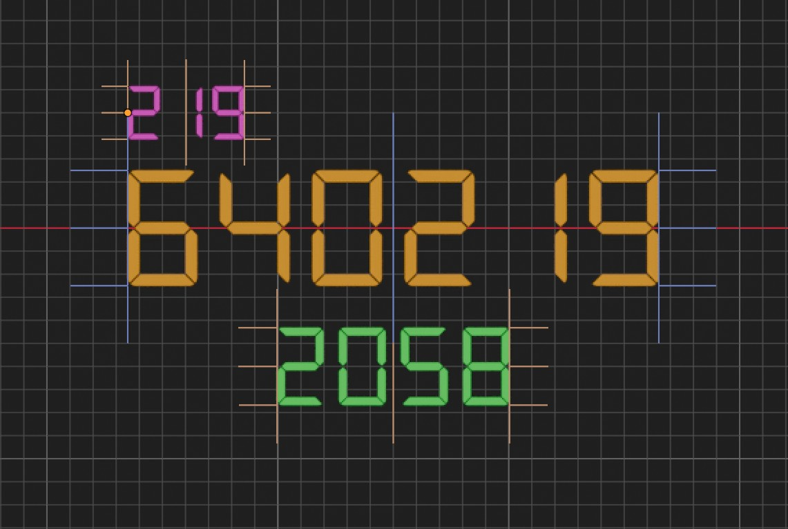
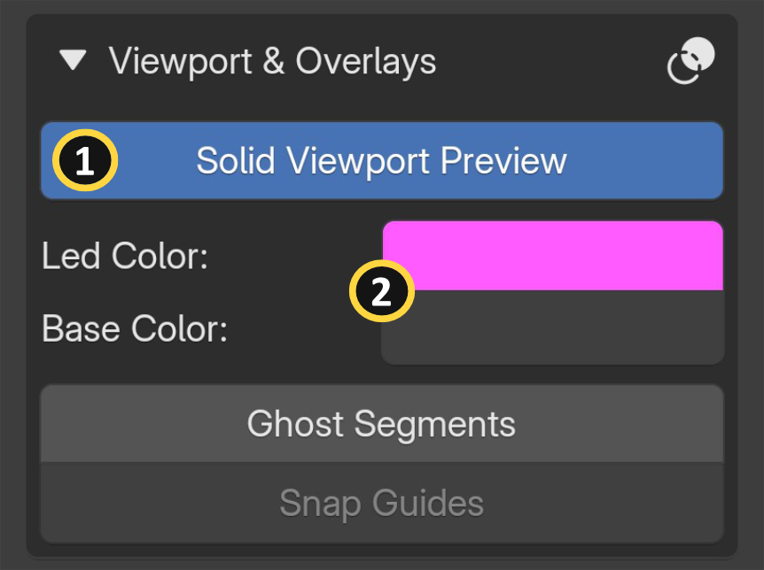
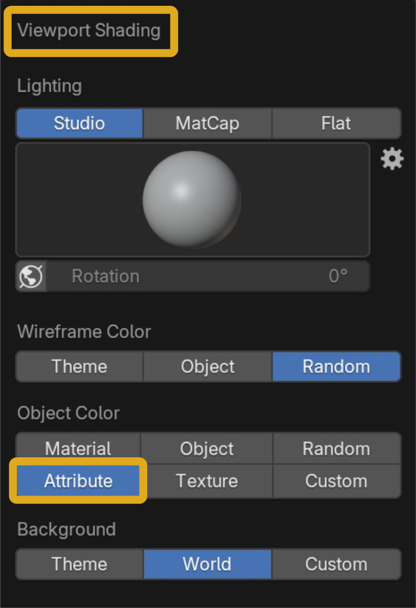
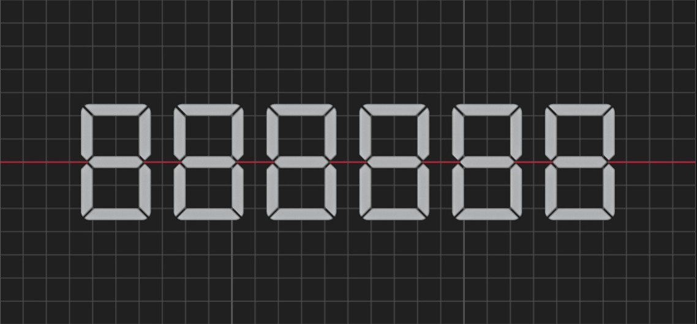
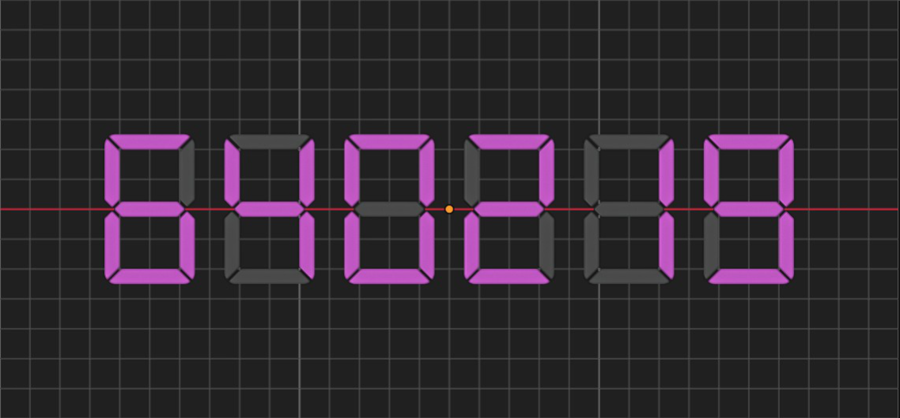
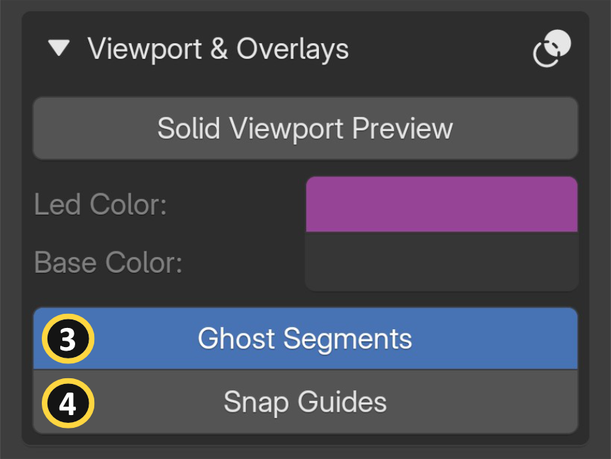
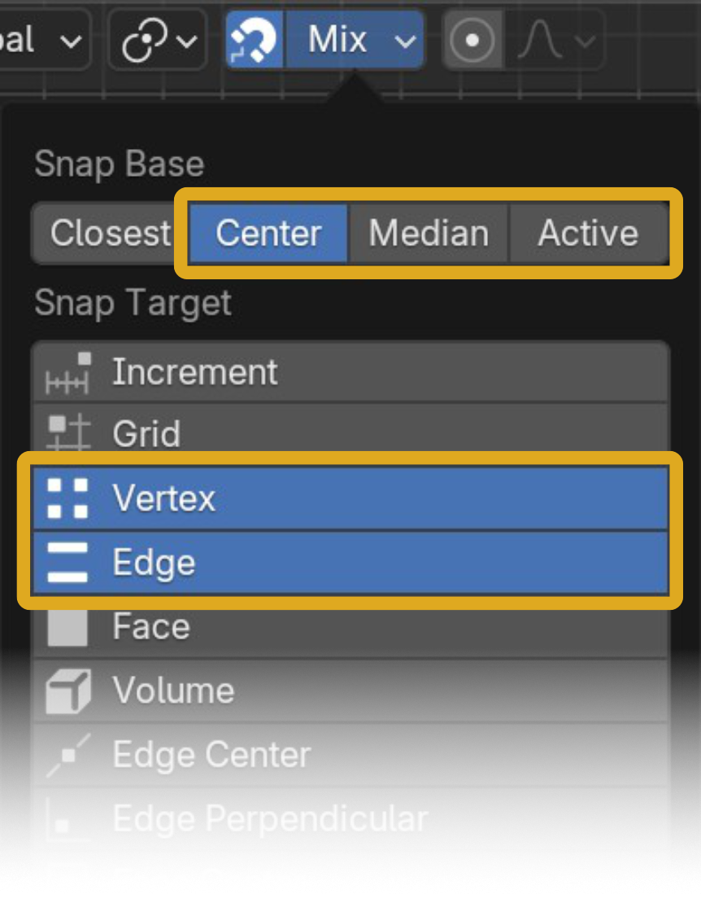

{ align=right width="400" }

In complex 3D scenes, constantly switching between viewport shading modes to check your segment display can slow you down. Real LED panels are visible from across a room, but in Blender's Solid viewport mode, material-based effects like emission aren't rendered. SegDisp Pro includes viewport utilities that let you preview your display without leaving Solid mode, so you don't have to switch to Material or Rendered view just to see your results, keeping performance smooth even in busy scenes. Additional overlays let you visualize inactive segments for easier layout and snap-align your display to other objects. This section covers all viewport and overlay inputs across two groups: Solid Viewport Preview and Overlay helpers.

## Viewport | Solid Preview

{ align=right width="400" }

{ align=right width="400" }

<figure class="img-hover" markdown>

  { width="600" }

  { .hover-img width="600" aria-hidden="true" }

</figure>

**[1] Solid Viewport Preview:** Allows the display results to be shown in Blender's "Solid" viewport shading mode by switching the Object Color Type to Attribute/Vertex. Useful when working in busy scenes where switching to Material or Rendered view would impact performance. 

**[2] Solid Viewport Preview:** Sets the temporary vertex color used for LED (active) segments and the Display Base in Solid viewport mode.

!!! warning wrap "Solid Viewport Preview operates at the Blender level, outside the add-on itself."
    Enabling it switches the Object Color Type to Attribute/Vertex across the entire scene — not just for the segment display object. As a result, all other objects in your scene will also adopt this color method, which may alter their appearance in Solid viewport mode. Use this option as a temporary result checker.

!!! info wrap
    If you switch the Object Color Type to Attribute manually from the Blender > Viewport Shading panel, the vertex color on the segment display object may not appear. This is because the Solid Viewport Preview button has not been toggled.

See the [Troubleshooting page](troubleshooting.md#viewport-solid-color-preview) for the Solid Viewport Preview

## Viewport | Overlays {: .clear }

{ align=right width="400" }

### Ghost Segments

**[3]** Toggles the visibility of inactive segments to help determine digit boundaries when "Display Base" is not enabled. 

!!! info wrap "Ghost segments are not visible in final renders."

### Snap Guides {: .clear}

{ align=right width="400" }

**[4]** Displays alignment guidelines when 3D viewport Snap is enabled, helping you align the segment display object with other scene items.

!!! info wrap "Snap Guides"
    Snap Guides are optimized for use with the **Highlighted Snap Target** set to **Vertex** and **Edge**. Additionally, the Highlighted Snap Base must be set to **Center**, **Median**, or **Active** from the Blender Snap menu.

<figure class="img-auto" markdown>

  { width="500" }

</figure>

!!! warning wrap "Blender Limitation"
    Snap Guides use wireframe geometry, which Blender does not display when the viewport Object Color Type is set to Attribute/Vertex. Because Solid Viewport Preview requires this mode, both features cannot be active at the same time.

